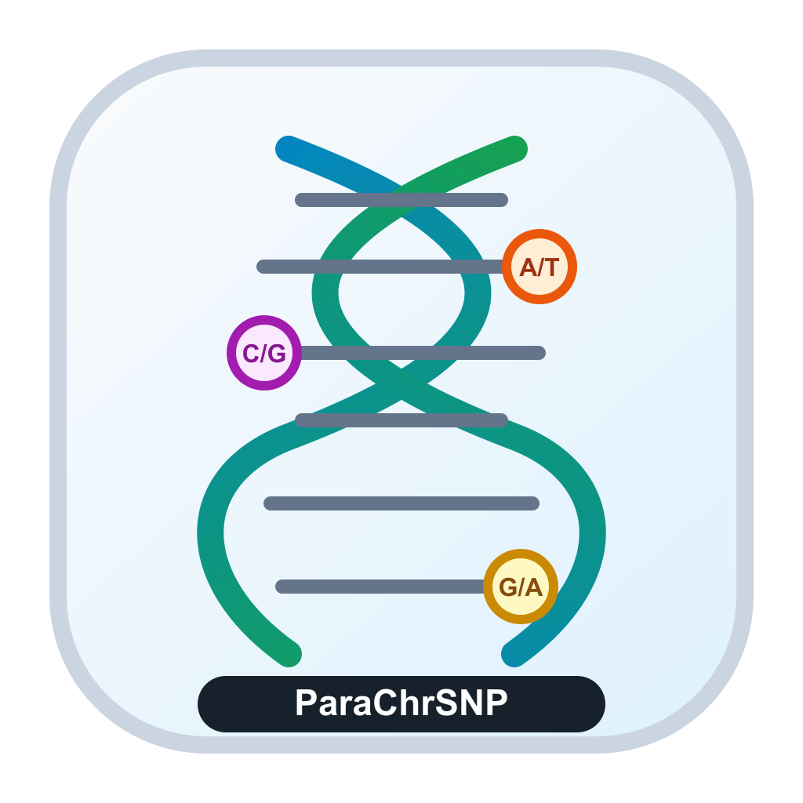
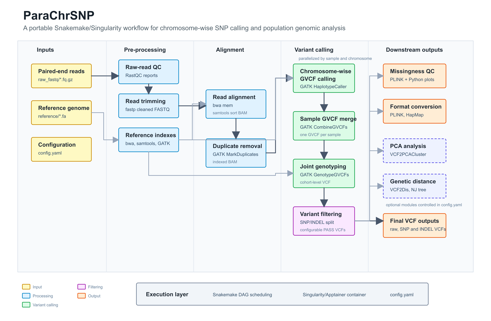

# ParaChrSNP

<p align="center">
  
</p>

`ParaChrSNP` 是一个按染色体并行进行 SNP calling 的 Snakemake 流程。流程从双端 FASTQ 开始，依次完成原始数据质控、`fastp` 清洗、`bwa mem | samtools sort` 比对、GATK 按染色体 calling、GVCF 合并、联合分型、SNP/INDEL 过滤、VCF 缺失率统计、常用格式转换、PCA 和遗传距离/系统发育树分析。

## Workflow



**Figure 1.** Overview of the ParaChrSNP workflow. ParaChrSNP is a portable Snakemake workflow packaged with Singularity/Apptainer for chromosome-wise variant discovery and downstream population genomic analysis. Paired-end FASTQ files and a reference genome are first processed through raw-read quality control, read trimming, reference indexing, alignment, duplicate removal and BAM indexing. GATK HaplotypeCaller is then executed in parallel across samples and chromosomes to generate per-chromosome GVCFs, followed by sample-level GVCF merging and cohort-level joint genotyping. The resulting VCF is split into SNP and INDEL datasets and filtered using configurable thresholds. Filtered SNPs are further used for genotype missingness assessment, PLINK/HapMap format conversion, and optional PCA, genetic distance estimation and phylogenetic tree construction.

## 下载

下载 ParaChrSNP 项目代码。

```bash
git clone https://github.com/majssssa/ParaChrSNP.git
cd ParaChrSNP

# git clone: 从 GitHub 下载 ParaChrSNP 项目代码。
# cd ParaChrSNP: 进入项目目录。
```

下载容器镜像

```bash
singularity pull ParaChrSNP.sif http://www.majunpeng.com/ParaChrSNP/ParaChrSNP.sif

# singularity pull: 从远程地址下载 Singularity 镜像。
# ParaChrSNP.sif: 下载后保存到项目根目录的容器文件名。
# FIGSHARE_DIRECT_DOWNLOAD_URL: Figshare 的直接下载链接，通常形如 https://figshare.com/ndownloader/files/文件ID。
```

## 配置输入文件

默认 FASTQ 命名格式如下：

```text
raw_fastq/{sample}.1.fq.gz
raw_fastq/{sample}.2.fq.gz
```

运行前需要检查并修改 `config.yaml`：

- `container.image`: 容器镜像路径，默认是项目根目录下的 `ParaChrSNP.sif`。
- `reference`: 参考基因组 FASTA 路径。
- `samples`: 样本名和 FASTQ 文件前缀。
- `chromosomes`: 需要逐条染色体 calling 的染色体名称，必须和参考基因组 FASTA 中的序列 ID 一致。
- `params.snp_filter` 和 `params.indel_filter`: SNP/INDEL 过滤参数。
- `params.vcf2pca.enabled`: 是否在完整流程中运行 PCA 分析，`true` 表示运行，`false` 表示不运行。VCF2PCACluster 至少需要 3 个样本；如果 `samples` 少于 3 个，完整流程会自动跳过该模块。
- `params.vcf2dis.enabled`: 是否在完整流程中运行遗传距离和系统发育树分析，`true` 表示运行，`false` 表示不运行。VCF2Dis 构建系统发育树至少需要 3 个样本；如果 `samples` 少于 3 个，完整流程会自动跳过该模块。
- `params.vcf2pca.sample_group`: 可选的 PCA 样本分组文件。留空或删除该参数时，不传入 `-InSampleGroup`。
- `params.vcf2dis.sample_group`: 可选的遗传距离样本分组文件。留空或删除该参数时，不传入 `-InSampleGroup`。

## 运行前检查

ParaChrSNP 在完整流程开始前会自动运行 `precheck`，用于检查 `config.yaml`、参考基因组、FASTQ 文件、染色体名称、可选分组文件和容器镜像是否可用。如果存在严重错误，流程会在正式计算前停止，避免运行到中后期才因为输入问题失败。

单独运行运行前检查。

```bash
snakemake --snakefile Snakefile --configfile config.yaml --cores 1 --use-singularity reports/precheck.done

# snakemake: 运行 Snakemake 工作流。
# --snakefile Snakefile: 指定流程入口文件。
# --configfile config.yaml: 指定流程配置文件。
# --cores 1: 运行该检查任务时使用 1 个 CPU 核心即可。
# --use-singularity: 在 ParaChrSNP.sif 容器中执行检查脚本。
# reports/precheck.done: 指定只生成 precheck 完成标记；同时会生成 reports/precheck.tsv 和 reports/precheck.html。
```

## 运行流程

检查 DAG 和输入文件是否完整。

```bash
snakemake --snakefile Snakefile --configfile config.yaml --cores 4 --use-singularity -n

# snakemake: 运行 Snakemake 工作流。
# --snakefile Snakefile: 指定流程入口文件。
# --configfile config.yaml: 指定流程配置文件。
# --cores 4: 允许 Snakemake 使用 4 个 CPU 核心。
# --use-singularity: 使用 Snakefile/config.yaml 中声明的 Singularity 容器执行各个 rule。
# -n: dry-run，只检查流程，不真正运行任务。
```

运行完整流程。

```bash
snakemake --snakefile Snakefile --configfile config.yaml --cores 30 --use-singularity

# --cores 30: 最多使用 30 个 CPU 核心。
# --use-singularity: 在 ParaChrSNP.sif 容器中运行各个 rule。
# --keep-going: 某个任务失败后，继续运行其他不依赖失败任务的作业。
```

如果 FASTQ 或参考基因组在项目目录外，需要额外挂载外部目录。

```bash
snakemake --snakefile Snakefile --configfile config.yaml --cores 30 --use-singularity --singularity-args "-B /data/fastq:/data/fastq -B /data/reference:/data/reference"

# --singularity-args: 传递额外的 Singularity 参数。
# -B /data/fastq:/data/fastq: 将宿主机 FASTQ 目录挂载到容器内相同路径。
# -B /data/reference:/data/reference: 将宿主机参考基因组目录挂载到容器内相同路径。
```

如果项目目录中的输入文件是软链接，并且软链接指向项目目录外的位置，也必须挂载软链接的真实目标目录。例如：

```bash
snakemake --snakefile Snakefile --configfile config.yaml --cores 12 --use-singularity --singularity-args "-B /home/majunpeng/sda2:/home/majunpeng/sda2"

# --cores 12: 最多使用 12 个 CPU 核心。
# --use-singularity: 使用 ParaChrSNP.sif 容器运行每个 rule。
# --singularity-args: 传递额外的 Singularity 挂载参数。
# -B /home/majunpeng/sda2:/home/majunpeng/sda2: 将宿主机的 /home/majunpeng/sda2 挂载到容器内相同路径，使 reference/ 和 raw_fastq/ 中指向该目录的软链接在容器内也能正常访问。
```

## 输出结果

主要结果文件包括：

- `qc/`: RastQC 原始数据质控结果。
- `clean_reads/`: `fastp` 清洗后的 FASTQ。
- `sorted_reads/`: 排序后的 BAM。
- `duplicate_removed/`: 去重复后的 BAM。
- `gvcf/`: 每个样本、每条染色体的 GVCF，以及样本级合并 GVCF。
- `result_vcfs/combined.vcf.gz`: 联合分型后的原始 VCF。
- `result_vcfs/combined.snp.filtered.vcf.gz`: 过滤后的 SNP 结果。
- `result_vcfs/combined.indel.filtered.vcf.gz`: 过滤后的 INDEL 结果。
- `missing/`: PLINK 缺失率统计结果和缺失率分布图。
- `format_convert/`: PLINK binary、PLINK text 和 HapMap 格式转换结果。
- `pca/ParaChrSNP.eigenvec`: VCF2PCACluster 输出的 PCA 坐标。
- `pca/ParaChrSNP.eigenval`: VCF2PCACluster 输出的 PCA 特征值。
- `dis/ParaChrSNP.p_dis.mat`: VCF2Dis 输出的样本遗传距离矩阵。
- `dis/ParaChrSNP.p_dis.nwk`: VCF2Dis 输出的 Newick 格式系统发育树。
- `reports/precheck.html`: 运行前检查报告。
- `reports/ParaChrSNP_report.html`: 流程汇总 HTML 报告，包含样本数、染色体数、质控、清洗、去重复、变异数量、缺失率和下游输出文件概览。
- `reports/ParaChrSNP_summary.tsv`: 流程核心统计指标表格，方便继续整理或作图。


## 联系方式
VX：mjp59876


email：1527552938@qq.com
