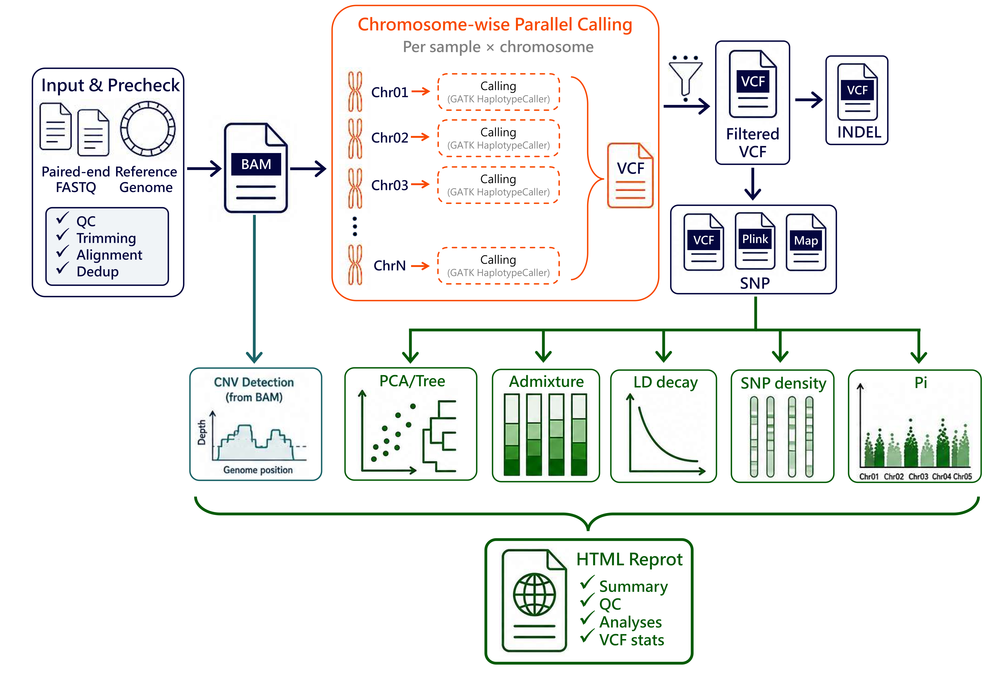

# ParaChrSNP


ParaChrSNP is a containerized Snakemake workflow for chromosome-wise SNP discovery and population-genomic analysis from paired-end resequencing data. It streamlines the full process from read quality control and alignment to cohort-level variant calling, filtering, annotation, format conversion, optional genotype imputation, CNV detection and downstream population analyses. The central design of ParaChrSNP is **per-sample by chromosome parallel variant calling**, which splits large variant-calling tasks into independent chromosome-level units and then integrates them into a cohort VCF for downstream analysis.

## Workflow

<p align="center">
  
</p>

**Figure 1.** ParaChrSNP is a containerized Snakemake workflow that processes paired-end resequencing reads into cohort-level variant calls and downstream population-genomic outputs. Input FASTQ files, a reference genome, optional genome annotation and population metadata are first checked for configuration consistency and executed within a Singularity or Apptainer container. Reads are assessed and cleaned, aligned to the reference genome with `bwa-mem2`, `bwa` or `minibwa`, sorted, deduplicated and indexed to generate analysis-ready BAM files. The central step is chromosome-wise parallel variant calling: for each sample and chromosome, variant discovery is executed as an independent calling unit, followed by chromosome-level joint genotyping and gathering into a cohort VCF. The cohort VCF is then separated into SNP and INDEL classes, filtered with configurable criteria, assessed for missingness, optionally imputed, annotated and converted into common downstream formats. CNV detection is performed from BAM read-depth information, whereas PCA/tree inference, ADMIXTURE structure analysis, LD decay, nucleotide diversity (Pi) and SNP-density profiling branch from the filtered SNP VCF. Final VCF files, analysis-ready format conversions, summary tables, figures and quality metrics are assembled into an integrated HTML report.

## Download

Clone the ParaChrSNP source code.

```bash
git clone https://github.com/majssssa/ParaChrSNP.git
cd ParaChrSNP
```

Download the Singularity/Apptainer container image.

```bash
singularity pull ParaChrSNP.sif http://www.majunpeng.com/ParaChrSNP/ParaChrSNP.sif
```

## Input Naming

By default, paired-end FASTQ files should follow this naming pattern:

```text
{sample}.1.fq.gz
{sample}.2.fq.gz
```

The sample name is `{sample}`. For example, `raw_fastq/SRR001.1.fq.gz` and `raw_fastq/SRR001.2.fq.gz` will be treated as one paired-end sample named `SRR001`.

## Configuration

```yaml
reference: "reference/Arabidopsis_thaliana.fasta"

container:
    image: "ParaChrSNP_sandbox"

samples:
    ERR16804307: "raw_fastq/ERR16804307"
    ERR16805220: "raw_fastq/ERR16805220"
    ERR16805679: "raw_fastq/ERR16805679"
    ERR16806713: "raw_fastq/ERR16806713"
chromosomes:
  - NC_003070.9
  - NC_003071.7
  - NC_003074.8
  - NC_003075.7
  - NC_003076.8
params:
    qc:
        threads: 4
        extra: "--nozip"

    aligner:
        name: "minibwa"
        executable: "minibwa"
        map_threads: 4
        sort_threads: 2
        index_threads: 4
        index_extra: ""
        map_extra: ""

    fastp:
        fastp_threads: 4

    haplotype_caller:
        threads: 4
        native_pair_hmm_threads: 4
        java_options: "--java-options \"-Xms512m -Xmx4g\""

    mark_duplicates:
        threads: 4
        java_options: "--java-options \"-Xmx10g\""

    genotype_gvcfs:
        java_options: "--java-options \"-Xms512m -Xmx128g\""

    combine_vcf:
        threads: 4
        java_options: "--java-options \"-Xms512m -Xmx128g\""

    joint_calling:
        method: "genomicsdb"
        reader_threads: 16
        genotype_threads: 1
        gather_threads: 1
        batch_size: 50
        import_java_options: "--java-options \"-Xms1g -Xmx16g\""
        genotype_java_options: "--java-options \"-Xms512m -Xmx128g\""
        gather_java_options: "--java-options \"-Xms512m -Xmx128g\""
        extra_import: ""
        extra_genotype: ""

    snp_filter:
        filter_name: "SNP_filter"
        thresholds:
            qd: 2.0
            mq: 40.0
            fs: 60.0
            sor: 3.0
            mq_rank_sum: -12.5
            read_pos_rank_sum: -8.0

    indel_filter:
        filter_name: "INDEL_filter"
        thresholds:
            qd: 2.0
            fs: 200.0
            sor: 10.0
            mq_rank_sum: -12.5
            read_pos_rank_sum: -8.0

    vcf_missing:
        output_prefix: "missing/combined.snp.filtered"
        plot_prefix: "missing/combined.snp.filtered.miss_check"
        plot_script: "scripts/plink-missing-nature_1.R"
        threads: 4
        extra: "--allow-extra-chr"

    vcf_convert:
        input_vcf: "result_vcfs/combined.snp.filtered.vcf.gz"
        output_prefix: "format_convert/combined.snp.filtered"
        plink_extra: "--allow-extra-chr"
        plink_threads: 4
        tassel_executable: "run_pipeline.pl"
        tassel_memory: "-Xmx10g"
        tassel_threads: 16
        tassel_extra: ""

    imputation:
        enabled: false
        input_vcf: "result_vcfs/combined.snp.filtered.vcf.gz"
        output_prefix: "imputation/combined.snp.filtered.beagle"
        jar: ""
        java_options: "-Xmx4g"
        threads: 4
        extra: ""

    cnv:
        enabled: false
        software: "cnvnator"
        executable: "cnvnator"
        vcf_converter: "cnvnator2VCF.pl"
        bin_size: 100
        reference_dir: "reference"
        extra: ""

    pi:
        enabled: false
        input_vcf: "result_vcfs/combined.snp.filtered.vcf.gz"
        pop_info: ""
        output_dir: "pi"
        window_size: 100000
        window_step: 10000
        extra: ""

    snp_density:
        enabled: false
        input_vcf: "result_vcfs/combined.snp.filtered.vcf.gz"
        output_dir: "snp_density"
        window_size: 1000000

    admixture:
        enabled: false
        input_prefix: "format_convert/combined.snp.filtered"
        output_dir: "admixture"
        executable: "admixture"
        k_min: 1
        k_max: 10
        cv: 10
        threads: 4
        prune_window: 50
        prune_step: 10
        prune_r2: 0.2
        geno: 0.999
        pop_info: ""
        show_sample_names: true
        plink_extra: "--allow-extra-chr"
        normalize_extra: "--allow-extra-chr --set-missing-var-ids @:#"
        admixture_plink_extra: "--allow-extra-chr 0"
        extra: ""

    ld_decay:
        enabled: false
        input_vcf: "result_vcfs/combined.snp.filtered.vcf.gz"
        pop_info: ""
        output_dir: "ld_decay"
        executable: "PopLDdecay"
        max_dist: 300
        threads: 1
        extra: ""

    vcf2pca:
        enabled: false
        executable: "VCF2PCACluster"
        sample_group: ""
        output_prefix: "pca/ParaChrSNP"
        threads: 4
        extra: ""

    vcf2dis:
        enabled: false
        executable: "VCF2Dis"
        sample_group: ""
        output_matrix: "dis/ParaChrSNP.p_dis.mat"
        output_tree: "dis/ParaChrSNP.p_dis.nwk"
        tree_method: 1
        extra: ""

    snpeff:
        enabled: false
        annotate_snp: true
        annotate_indel: false
        executable: "snpEff"
        genome_name: "custom_genome"
        data_dir: "annotation/snpeff_data"
        config_file: "annotation/snpeff.config"
        genome_fasta: "reference/Arabidopsis_thaliana.fasta"
        annotation_file: "reference/Arabidopsis_thaliana.gff"
        annotation_format: "gff3"
        output_prefix: "annotation/combined"
        database_done: "annotation/snpeff_db.done"
        java_options: "-Xmx32g"
        threads: 1
        extra: ""
```

Before running the workflow, edit `config.yaml` and check the following fields:

- `container.image`: Path to the Singularity/Apptainer image or sandbox directory. Use `ParaChrSNP.sif` for the image file or `ParaChrSNP_sandbox` after sandbox extraction.
- `reference`: Reference genome FASTA file.
- `samples`: Sample names and FASTQ prefixes.
- `chromosomes`: Chromosome IDs for chromosome-wise calling. These names must match the sequence IDs in the reference FASTA.
- `params.qc.threads`: Number of threads used by RastQC.
- `params.fastp.fastp_threads`: Number of threads used by `fastp`.
- `params.aligner.name`: Alignment backend. Supported values are `bwa-mem2`, `bwa`, and `minibwa`.
- `params.aligner.executable`: Alignment executable or full executable path, for example `bwa-mem2`, `bwa`, `minibwa`, or `/home/majunpeng/Software/minibwa/minibwa`.
- `params.aligner.map_threads`: Number of threads used by `bwa-mem2 mem`, `bwa mem`, or `minibwa map`.
- `params.aligner.sort_threads`: Number of threads used by `samtools sort`. The `bwa_mem` rule reserves `map_threads + sort_threads` CPU threads in Snakemake.
- `params.aligner.index_threads`: Number of threads used by `minibwa index`. This option is ignored by bwa-mem2 and bwa indexing.
- `params.aligner.index_extra` and `params.aligner.map_extra`: Extra options passed to the selected aligner's index and mapping commands.
- `params.joint_calling.method`: Joint-calling strategy. The default is `genomicsdb`, which is recommended for multiple samples. The legacy strategy can be selected with `combine_gvcfs`.
- `params.joint_calling.reader_threads`: Number of reader threads used by `GenomicsDBImport`.
- `params.joint_calling.batch_size`: Number of samples imported per batch by `GenomicsDBImport`. Reduce this value for large cohorts or limited memory.
- `params.joint_calling.import_java_options`: Java memory options for `GenomicsDBImport`.
- `params.joint_calling.genotype_java_options`: Java memory options for chromosome-level `GenotypeGVCFs`.
- `params.snp_filter` and `params.indel_filter`: Configurable filtering thresholds for SNPs and INDELs.
- `params.vcf_missing.threads`: Number of threads passed to PLINK `--missing`.
- `params.vcf_convert.plink_threads`: Number of threads passed to PLINK format-conversion commands.
- `params.vcf_convert.tassel_threads`: CPU count exposed to TASSEL through `JAVA_TOOL_OPTIONS` for HapMap conversion.
- `params.vcf2pca.enabled`: Whether to run PCA analysis. `VCF2PCACluster` requires at least three samples; the full workflow automatically skips this module when fewer than three samples are configured.
- `params.vcf2dis.enabled`: Whether to run genetic-distance and phylogenetic-tree analysis. `VCF2Dis` requires at least three samples; the full workflow automatically skips this module when fewer than three samples are configured.
- `params.vcf2pca.sample_group`: Optional sample-group file for PCA. When empty or absent, `-InSampleGroup` is not passed to VCF2PCACluster.
- `params.vcf2pca.plot_prefix`: Optional output prefix for PCA plots. The default is `params.vcf2pca.output_prefix + ".plot"`.
- `params.vcf2dis.sample_group`: Optional sample-group file for genetic distance analysis. When empty or absent, `-InSampleGroup` is not passed to VCF2Dis.
- `params.imputation.enabled`: Whether to run Beagle genotype imputation. When enabled, the module generates `imputation/combined.snp.filtered.beagle.vcf.gz` and its index.
- `params.imputation.java_options`: Java memory options for Beagle. The default is `-Xmx4g`.
- `params.cnv.enabled`: Whether to run CNVnator copy-number variant detection from `duplicate_removed/{sample}.rmdup.bam`.
- `params.cnv.bin_size`: CNVnator bin size. A value of `100` is suitable for medium-depth resequencing data; low-depth data may require `500` or `1000`.
- `params.cnv.vcf_converter`: Script used to convert CNVnator output to VCF. The default is `cnvnator2VCF.pl` inside the container.
- `params.pi.enabled`: Whether to calculate window-based nucleotide diversity (Pi) and draw a Manhattan-style plot.
- `params.pi.pop_info`: Optional two-column population file. The first column is sample ID and the second column is population ID. When empty, all samples are treated as one group named `All`.
- `params.pi.window_size` and `params.pi.window_step`: Window size and step size for Pi calculation, in base pairs.
- `params.snp_density.enabled`: Whether to run SNP-density plotting from the filtered SNP VCF.
- `params.snp_density.window_size`: Non-overlapping window size for SNP-density calculation. The default is `1000000` bp.
- `params.admixture.enabled`: Whether to run ADMIXTURE population-structure analysis. The module first performs PLINK LD pruning and then runs ADMIXTURE for each K value from `k_min` to `k_max`.
- `params.admixture.k_min` and `params.admixture.k_max`: K range tested by ADMIXTURE.
- `params.admixture.cv`: Number of cross-validation folds used by ADMIXTURE.
- `params.admixture.geno`: PLINK site-missingness threshold before ADMIXTURE. The default is `0.999`, which removes completely missing sites.
- `params.admixture.normalize_extra`: Extra PLINK options for building the ADMIXTURE input dataset. The default fills missing SNP IDs.
- `params.admixture.admixture_plink_extra`: Extra PLINK options before exporting ADMIXTURE input. The default converts non-standard chromosome names to `0` for ADMIXTURE compatibility.
- `params.admixture.pop_info`: Optional two-column sample-group file for sorting the structure plot. When provided, samples are plotted strictly in the order of the first column in this file; FAM samples absent from `pop_info` are appended at the end in PLINK FAM order. When empty, samples are displayed in PLINK FAM order.
- `params.admixture.show_sample_names`: Whether to show sample names on the ADMIXTURE structure plot. Use `true` for small sample sets and `false` for large cohorts.
- `params.ld_decay.enabled`: Whether to run PopLDdecay. The module calculates LD decay for all samples together or for each group defined by `pop_info`.
- `params.ld_decay.pop_info`: Optional two-column population file. When empty, all samples are merged into one group named `All`.
- `params.ld_decay.max_dist`: Maximum distance used by PopLDdecay.
- `params.snpeff.enabled`: Whether to run SnpEff annotation. For non-model organisms, provide a genome FASTA and a GFF3/GTF gene annotation file.
- `params.snpeff.genome_name`: Custom SnpEff database name. Use a simple string without spaces.
- `params.snpeff.genome_fasta`: Reference genome FASTA used to build the SnpEff database.
- `params.snpeff.annotation_file`: GFF3/GTF annotation file used to build the SnpEff database.
- `params.snpeff.annotation_format`: Annotation format. Supported values are `gff3` and `gtf`.
- `params.snpeff.build_check_options`: SnpEff database-build checking options. The default is `-noCheckCds -noCheckProtein`, which is suitable for non-model organisms without CDS/protein FASTA files.

The SnpEff custom database is built only from sequences listed in `chromosomes`, avoiding failures caused by uncalled organellar, unplaced or problematic annotation records.

## Alignment Backend

ParaChrSNP now uses a single alignment configuration block, `params.aligner`. The old `params.bwa` block is no longer needed in new configuration files. Existing old configuration files are still tolerated by the workflow for backward compatibility, but new runs should only edit `params.aligner`.

Use `minibwa` for faster short-read alignment.

```yaml
params:
    aligner:
        name: "minibwa"
        executable: "minibwa"
        map_threads: 4
        sort_threads: 2
        index_threads: 4
        index_extra: ""
        map_extra: ""
```

Use `bwa-mem2` when you prefer the established BWA-MEM2 backend.

```yaml
params:
    aligner:
        name: "bwa-mem2"
        executable: "bwa-mem2"
        map_threads: 4
        sort_threads: 2
        index_threads: 4
        index_extra: ""
        map_extra: ""
```

When `name` is `minibwa`, ParaChrSNP builds and checks the `.l2b` and `.mbw` index files. When `name` is `bwa-mem2` or `bwa`, ParaChrSNP builds and checks the BWA-style index files `.0123`, `.amb`, `.ann`, `.bwt.2bit.64` and `.pac`. Switching the aligner can therefore trigger reference re-indexing, which is expected.

## Precheck

ParaChrSNP automatically runs a `precheck` step before the full workflow. This step validates `config.yaml`, the reference genome, FASTQ files, chromosome names, optional group files and the container image. Fatal errors are reported before expensive downstream jobs are submitted.

Run only the precheck step.

```bash
snakemake --snakefile Snakefile --configfile config.yaml --cores 1 --use-singularity reports/precheck.done

# snakemake: Run the Snakemake workflow.
# --snakefile Snakefile: Use Snakefile as the workflow entry point.
# --configfile config.yaml: Use config.yaml as the workflow configuration file.
# --cores 1: Use one CPU core for the precheck target.
# --use-singularity: Execute the rule inside the configured Singularity/Apptainer container.
# reports/precheck.done: Build only the precheck completion flag; reports/precheck.tsv and reports/precheck.html are also generated.
```

## Run The Workflow

Pre-extracting the Singularity/Apptainer container into a sandbox directory can substantially reduce repeated container startup overhead and improve overall workflow runtime, especially for large-scale Snakemake jobs with many rules. After pre-extracting the image, set `container.image` in `config.yaml` to the sandbox directory path so ParaChrSNP uses the pre-extracted container during workflow execution.

```bash
singularity build --sandbox ParaChrSNP_sandbox ParaChrSNP.sif
```

Check the DAG and input availability without executing jobs.

```bash
snakemake --snakefile Snakefile --configfile config.yaml --cores 4 --use-singularity -n

# snakemake: Run the Snakemake workflow.
# --snakefile Snakefile: Use Snakefile as the workflow entry point.
# --configfile config.yaml: Use config.yaml as the workflow configuration file.
# --cores 4: Allow Snakemake to schedule up to four CPU cores.
# --use-singularity: Execute containerized rules with the image or sandbox defined by container.image.
# -n: Dry-run mode; print the planned jobs without executing them.
```

Run the complete workflow.

```bash
snakemake --snakefile Snakefile --configfile config.yaml --cores 30 --use-singularity

# snakemake: Run the Snakemake workflow.
# --snakefile Snakefile: Use Snakefile as the workflow entry point.
# --configfile config.yaml: Use config.yaml as the workflow configuration file.
# --cores 30: Allow Snakemake to use up to 30 CPU cores.
# --use-singularity: Execute containerized rules with the image or sandbox defined by container.image.
```

If FASTQ files or the reference genome are outside the project directory, bind the external directories into the container.

```bash
snakemake --snakefile Snakefile --configfile config.yaml --cores 30 --use-singularity --singularity-args "-B /data/fastq:/data/fastq -B /data/reference:/data/reference"

# snakemake: Run the Snakemake workflow.
# --snakefile Snakefile: Use Snakefile as the workflow entry point.
# --configfile config.yaml: Use config.yaml as the workflow configuration file.
# --cores 30: Allow Snakemake to use up to 30 CPU cores.
# --use-singularity: Execute rules inside the configured container.
# --singularity-args: Pass extra arguments to Singularity/Apptainer.
# "-B /data/fastq:/data/fastq -B /data/reference:/data/reference": Bind external host directories into the same paths inside the container.
```

## Web Interface

ParaChrSNP includes a lightweight server-side web launcher. It allows users to browse server directories, select the reference genome, GFF/GTF annotation file, FASTQ directory and Singularity/Apptainer container, auto-detect samples and chromosome IDs, generate a run-specific `config.yaml`, and submit Snakemake jobs. The web interface does not upload large FASTQ/FASTA/VCF files; it only uses existing server-side paths.

Start the web interface.

```bash
python web/parachrsnp_web.py --host 0.0.0.0 --port 8088 --allowed-root /home/majunpeng/sda2
```

Open the web page in a browser.

```text
http://SERVER_IP:8088
```

<p align="center">
  
</p>

Each submitted job writes its generated configuration and logs to `web_runs/`. This is a runtime directory and is ignored by Git by default.

The web interface currently supports:

- Selecting FASTQ directories, reference genomes, annotation files and container images through a server-side file browser.
- Automatically detecting paired-end samples named `{sample}.1.fq.gz` and `{sample}.2.fq.gz`.
- Reading chromosome IDs from FASTA headers.
- Enabling optional modules including PCA, genetic distance/tree inference, SnpEff annotation, Beagle imputation, CNVnator CNV detection, ADMIXTURE, LD decay, Pi and SNP density.
- Showing job status, sample count, chromosome count, completed rule count and progress bars.
- Preserving raw Snakemake logs for troubleshooting.

## Outputs

Main output files include:

- `qc/`: RastQC raw-read quality-control results.
- `clean_reads/`: FASTQ files cleaned by `fastp`.
- `sorted_reads/`: Sorted BAM files.
- `duplicate_removed/`: Duplicate-removed BAM files.
- `gvcf/`: Per-sample and per-chromosome GVCF files. When `params.joint_calling.method: "combine_gvcfs"` is used, sample-level merged GVCFs are also generated.
- `genomicsdb/workspace/`: Per-chromosome GenomicsDB workspaces generated by the `genomicsdb` joint-calling method.
- `result_vcfs/by_chrom/`: Per-chromosome jointly genotyped VCF files generated by the `genomicsdb` method.
- `result_vcfs/combined.vcf.gz`: Raw cohort VCF after joint genotyping.
- `result_vcfs/combined.snp.filtered.vcf.gz`: Filtered SNP VCF.
- `result_vcfs/combined.indel.filtered.vcf.gz`: Filtered INDEL VCF.
- `missing/`: PLINK missingness statistics and Nature-style missingness plots in PDF, SVG and TIFF formats.
- `format_convert/`: PLINK binary, PLINK text and HapMap conversion outputs.
- `imputation/combined.snp.filtered.beagle.vcf.gz`: Beagle-imputed SNP VCF, generated when `params.imputation.enabled` is true.
- `cnv/{sample}.cnvnator.txt`: Raw CNVnator CNV calls for each sample.
- `cnv/{sample}.cnv.tsv`: Unfiltered standardized CNV table for each sample.
- `cnv/{sample}.cnv.vcf`: CNV VCF converted by `cnvnator2VCF.pl`.
- `cnv/combined.cnv.tsv`: Combined unfiltered CNV table for all samples.
- `cnv/combined.cnv.summary.tsv`: CNV summary table by sample, type and chromosome.
- `cnv/figures/cnv_count_by_sample.pdf`: CNV count plot by sample, also exported as SVG and TIFF.
- `cnv/figures/cnv_length_distribution.pdf`: CNV length distribution plot, also exported as SVG and TIFF.
- `cnv/figures/cnv_count_by_chromosome.pdf`: CNV count plot by chromosome, also exported as SVG and TIFF.
- `pi/combined.windowed.pi.tsv`: Window-based Pi table with population, chromosome, window coordinates, SNP count and Pi value.
- `pi/pi.summary.tsv`: Summary statistics for the Pi module.
- `pi/figures/pi_manhattan.pdf`: Manhattan-style Pi plot, also exported as PNG, SVG and TIFF.
- `snp_density/snp_density.tsv`: SNP count table for each chromosome window.
- `snp_density/figures/snp_density.pdf`: Chromosome-band SNP-density heatmap, also exported as PNG, SVG and TIFF.
- `admixture/pruned/admixture_pruned.bed/.bim/.fam`: LD-pruned PLINK binary files used by ADMIXTURE.
- `admixture/admixture_pruned.K.Q`: ADMIXTURE Q matrix for each K value.
- `admixture/cv_errors.tsv`: Cross-validation error table across K values.
- `admixture/figures/admixture_structure.pdf`: ADMIXTURE structure plot, also exported as PNG, SVG and TIFF.
- `admixture/figures/admixture_cv_error.pdf`: ADMIXTURE CV-error plot, also exported as PNG, SVG and TIFF.
- `ld_decay/stats/*.stat.gz`: Raw PopLDdecay statistics.
- `ld_decay/combined.ld_decay.tsv`: Tidy LD-decay table with group, distance and r2.
- `ld_decay/figures/ld_decay.pdf`: LD-decay curve, also exported as PNG, SVG and TIFF.
- `pca/ParaChrSNP.eigenvec`: PCA coordinates generated by VCF2PCACluster.
- `pca/ParaChrSNP.eigenval`: PCA eigenvalues generated by VCF2PCACluster.
- `pca/ParaChrSNP.plot.C.PC1_PC2.p.svg`: Two-dimensional PCA plot generated by Plot2Deig.
- `pca/ParaChrSNP.plot.C.PC1_PC2.p.png`: PNG converted from the two-dimensional PCA SVG.
- `pca/ParaChrSNP.plot.C.3DPC1PC2PC3.pdf`: Three-dimensional PCA plot generated by Plot3Deig.
- `dis/ParaChrSNP.p_dis.mat`: Sample genetic-distance matrix generated by VCF2Dis.
- `dis/ParaChrSNP.p_dis.nwk`: Newick phylogenetic tree generated by VCF2Dis.
- `annotation/snpeff_data/`: Custom SnpEff database directory.
- `annotation/combined.snp.snpeff.vcf.gz`: SnpEff-annotated SNP VCF.
- `annotation/combined.snp.snpeff.html`: SnpEff SNP annotation summary report.
- `annotation/combined.indel.snpeff.vcf.gz`: SnpEff-annotated INDEL VCF, generated only when `params.snpeff.annotate_indel: true`.
- `reports/precheck.html`: Precheck report.
- `reports/ParaChrSNP_report.html`: Integrated HTML report with sample count, chromosome count, QC metrics, cleaned-read statistics, sequencing depth, duplicate metrics, variant counts, missingness and downstream output summaries.
- `reports/ParaChrSNP_summary.tsv`: Core workflow summary table for downstream reporting and plotting.

## Quick start

Download example data.

```bash
wget http://www.majunpeng.com/ParaChrSNP/example.tar.gz

# wget: Download the ParaChrSNP example dataset archive.
# http://www.majunpeng.com/ParaChrSNP/example.tar.gz: URL of the example data archive.
```

Extract the example data archive.

```bash
tar -xvf example.tar.gz

# tar: Extract files from an archive.
# -xvf: Extract files, print extracted file names, and read from the specified archive.
# example.tar.gz: Input example data archive.
```

Create the expected input directories.

```bash
mkdir raw_fastq && mkdir reference

# mkdir raw_fastq: Create the directory for paired-end FASTQ files.
# &&: Run the second command only if the first command succeeds.
# mkdir reference: Create the directory for the reference genome and related files.
```

Move the example reference genome files into the reference directory.

```bash
mv example/Arabidopsis_thaliana* ./reference/

# mv: Move files or directories.
# example/Arabidopsis_thaliana*: Match all example Arabidopsis reference files.
# ./reference/: Destination reference directory.
```

Move the example FASTQ files into the raw FASTQ directory.

```bash
mv example/*.fq.gz ./raw_fastq/

# mv: Move files or directories.
# example/*.fq.gz: Match all compressed FASTQ files in the example directory.
# ./raw_fastq/: Destination FASTQ directory.
```

Run the workflow with the configured container image or sandbox.

```bash
snakemake --snakefile Snakefile --configfile config.yaml --cores 64 --use-singularity

# snakemake: Run the ParaChrSNP workflow.
# --snakefile Snakefile: Use Snakefile as the workflow entry point.
# --configfile config.yaml: Use config.yaml as the workflow configuration file.
# --cores 64: Allow Snakemake to use up to 64 CPU cores.
# --use-singularity: Execute containerized rules with the image or sandbox defined by container.image.
```

## Contact

Author: Junpeng Ma  
Email: 1527552938@qq.com  
WeChat: mjp59876
