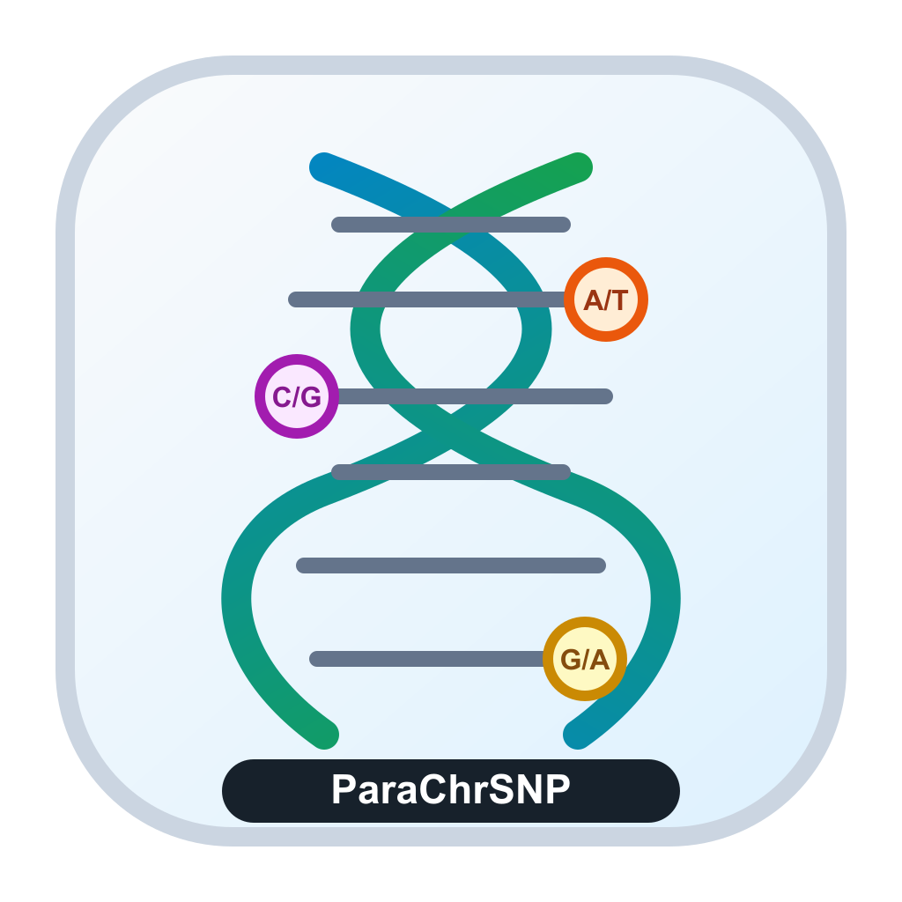

# ParaChrSNP

<p align="center">
  
</p>

`ParaChrSNP` 是一个按染色体并行进行 SNP calling 的 Snakemake 流程。流程从双端 FASTQ 开始，依次完成原始数据质控、`fastp` 清洗、`bwa-mem2 mem | samtools sort` 比对、GATK 按染色体 calling、基于 `GenomicsDBImport` 的多样本联合分型、SNP/INDEL 过滤、VCF 缺失率统计、常用格式转换、PCA 和遗传距离/系统发育树分析。

## Workflow

<p align="center">
  
</p>

**Figure 1.** Overview of the ParaChrSNP workflow. ParaChrSNP is a portable Snakemake workflow packaged with Singularity/Apptainer for chromosome-wise variant discovery and downstream population genomic analysis. Paired-end FASTQ files and a reference genome are first processed through raw-read quality control, read trimming, reference indexing, alignment, duplicate removal and BAM indexing. GATK HaplotypeCaller is then executed in parallel across samples and chromosomes to generate per-chromosome GVCFs, followed by chromosome-level GenomicsDBImport and cohort-level joint genotyping. The resulting VCF is split into SNP and INDEL datasets and filtered using configurable thresholds. Filtered SNPs are further used for genotype missingness assessment, PLINK/HapMap format conversion, and optional PCA, genetic distance estimation and phylogenetic tree construction.

## 下载

下载 ParaChrSNP 项目代码。

```bash
git clone https://github.com/majssssa/ParaChrSNP.git
cd ParaChrSNP

# git clone: 从 GitHub 下载 ParaChrSNP 项目代码。
# cd ParaChrSNP: 进入项目目录。
```

下载容器镜像

```bash
singularity pull ParaChrSNP.sif http://www.majunpeng.com/ParaChrSNP/ParaChrSNP.sif

# singularity pull: 从远程地址下载 Singularity 镜像。
# ParaChrSNP.sif: 下载后保存到项目根目录的容器文件名。
# FIGSHARE_DIRECT_DOWNLOAD_URL: Figshare 的直接下载链接，通常形如 https://figshare.com/ndownloader/files/文件ID。
```

## 配置输入文件

默认 FASTQ 命名格式如下：

```text
raw_fastq/{sample}.1.fq.gz
raw_fastq/{sample}.2.fq.gz
```

运行前需要检查并修改 `config.yaml`：

- `container.image`: 容器镜像路径，默认是项目根目录下的 `ParaChrSNP.sif`。
- `reference`: 参考基因组 FASTA 路径。
- `samples`: 样本名和 FASTQ 文件前缀。
- `chromosomes`: 需要逐条染色体 calling 的染色体名称，必须和参考基因组 FASTA 中的序列 ID 一致。
- `params.bwa.executable`: 比对程序，默认使用 `bwa-mem2`，也可以设置为自定义路径下的 `bwa-mem2` 可执行文件。
- `params.joint_calling.method`: 联合分型方法，默认 `genomicsdb`，适合多样本；如果需要使用旧方案，可改为 `combine_gvcfs`。
- `params.joint_calling.reader_threads`: `GenomicsDBImport` 读取 gVCF 的线程数。
- `params.joint_calling.batch_size`: `GenomicsDBImport` 每批导入的样本数，样本很多或内存不足时可适当降低。
- `params.joint_calling.import_java_options`: `GenomicsDBImport` 的 Java 内存参数。
- `params.joint_calling.genotype_java_options`: 按染色体 `GenotypeGVCFs` 的 Java 内存参数。
- `params.snp_filter` 和 `params.indel_filter`: SNP/INDEL 过滤参数。
- `params.vcf2pca.enabled`: 是否在完整流程中运行 PCA 分析，`true` 表示运行，`false` 表示不运行。VCF2PCACluster 至少需要 3 个样本；如果 `samples` 少于 3 个，完整流程会自动跳过该模块。
- `params.vcf2dis.enabled`: 是否在完整流程中运行遗传距离和系统发育树分析，`true` 表示运行，`false` 表示不运行。VCF2Dis 构建系统发育树至少需要 3 个样本；如果 `samples` 少于 3 个，完整流程会自动跳过该模块。
- `params.vcf2pca.sample_group`: 可选的 PCA 样本分组文件。留空或删除该参数时，不传入 `-InSampleGroup`。
- `params.vcf2pca.plot_prefix`: 可选的 PCA 作图输出前缀。默认使用 `params.vcf2pca.output_prefix + ".plot"`。
- `params.vcf2dis.sample_group`: 可选的遗传距离样本分组文件。留空或删除该参数时，不传入 `-InSampleGroup`。
- `params.imputation.enabled`: 是否运行 Beagle 基因型填充，默认关闭。开启后输出 `imputation/combined.snp.filtered.beagle.vcf.gz` 和索引文件。
- `params.imputation.java_options`: Beagle 的 Java 内存参数，默认 `-Xmx4g`，可按数据量调整。
- `params.cnv.enabled`: 是否运行 CNVnator 拷贝数变异检测，默认关闭。开启后会基于 `duplicate_removed/{sample}.rmdup.bam` 进行 read depth CNV calling。
- `params.cnv.bin_size`: CNVnator 的 bin size。中等深度重测序可先使用 `100`；低深度数据建议改为 `500` 或 `1000`。
- `params.cnv.vcf_converter`: CNVnator 原始结果转 VCF 的脚本，默认使用容器中的 `cnvnator2VCF.pl`。
- CNV 模块默认不做阈值过滤，`cnv/{sample}.cnv.tsv`、`cnv/combined.cnv.tsv` 和 `cnv/{sample}.cnv.vcf` 均保留 CNVnator 原始 call。
- `params.pi.enabled`: 是否运行窗口 Pi 统计和曼哈顿图绘制模块，默认关闭。开启后基于过滤后的 SNP VCF 计算窗口核苷酸多样性。
- `params.pi.pop_info`: 可选的群体分组文件，格式为两列：第一列样本名，第二列群体名。留空时将所有样本作为 `All` 统一计算。
- `params.pi.window_size` 和 `params.pi.window_step`: Pi 统计窗口大小和滑动步长，单位为 bp。
- `params.snp_density.enabled`: 是否运行 SNP 密度绘图模块。开启后基于过滤后的 SNP VCF 生成染色体窗口密度热图。
- `params.snp_density.window_size`: SNP 密度统计的非重叠窗口大小，单位为 bp，默认 `1000000`（1 Mb）。
- `params.admixture.enabled`: 是否运行 ADMIXTURE 群体结构分析，默认关闭。开启后基于 PLINK binary 文件先进行 LD pruning，再按 `k_min` 到 `k_max` 逐个 K 值运行 ADMIXTURE。
- `params.admixture.k_min` 和 `params.admixture.k_max`: ADMIXTURE 测试的 K 值范围。
- `params.admixture.cv`: ADMIXTURE 交叉验证折数，用于比较不同 K 值。
- `params.admixture.geno`: ADMIXTURE 前的 PLINK 位点缺失率过滤阈值，默认 `0.999`，用于去掉全缺失位点。
- `params.admixture.normalize_extra`: ADMIXTURE 前构建专用 PLINK 数据集的额外参数，默认会补齐缺失 SNP ID。
- `params.admixture.admixture_plink_extra`: 输出 ADMIXTURE 输入文件前的额外 PLINK 参数，默认把非标准染色体编号转成 `0`，以兼容 ADMIXTURE。
- `params.admixture.pop_info`: 可选的两列样本分组文件，用于结构图中按群体排序；留空时按 PLINK FAM 文件顺序展示。
- `params.admixture.show_sample_names`: 是否在 ADMIXTURE 结构图 X 轴显示样本名。样本较少时可设为 `true`，样本较多时建议设为 `false`。
- `params.ld_decay.enabled`: 是否运行 PopLDdecay LD 衰减分析，默认关闭。开启后基于过滤后的 SNP VCF 计算全体样本或每个群体的 LD 衰减曲线。
- `params.ld_decay.pop_info`: 可选的两列样本分组文件。留空时所有样本合并为 `All`；提供时按第二列群体分别计算 LD 衰减。
- `params.ld_decay.max_dist`: PopLDdecay 的最大统计距离，单位遵循 PopLDdecay 参数定义，默认 `300`。
- `params.snpeff.enabled`: 是否运行 SnpEff 注释模块，默认关闭。非模式生物需要提供参考基因组 FASTA 和 GFF3/GTF 基因结构注释文件。
- `params.snpeff.genome_name`: SnpEff 自定义数据库名称，建议使用不含空格的简单字符串。
- `params.snpeff.genome_fasta`: 用于构建 SnpEff 数据库的参考基因组 FASTA。
- `params.snpeff.annotation_file`: 用于构建 SnpEff 数据库的 GFF3/GTF 注释文件。
- `params.snpeff.annotation_format`: 注释文件格式，可选 `gff3` 或 `gtf`。
- `params.snpeff.build_check_options`: SnpEff 构建数据库时的校验控制参数，默认 `-noCheckCds -noCheckProtein`，适合没有 CDS/protein FASTA 的非模式生物注释。
- SnpEff 自定义数据库默认只保留 `chromosomes` 中配置的序列和注释，避免未参与 calling 的叶绿体、线粒体或未定位序列中的异常注释导致数据库构建失败。

## 运行前检查

ParaChrSNP 在完整流程开始前会自动运行 `precheck`，用于检查 `config.yaml`、参考基因组、FASTQ 文件、染色体名称、可选分组文件和容器镜像是否可用。如果存在严重错误，流程会在正式计算前停止，避免运行到中后期才因为输入问题失败。

单独运行运行前检查。

```bash
snakemake --snakefile Snakefile --configfile config.yaml --cores 1 --use-singularity reports/precheck.done

# snakemake: 运行 Snakemake 工作流。
# --snakefile Snakefile: 指定流程入口文件。
# --configfile config.yaml: 指定流程配置文件。
# --cores 1: 运行该检查任务时使用 1 个 CPU 核心即可。
# --use-singularity: 在 ParaChrSNP.sif 容器中执行检查脚本。
# reports/precheck.done: 指定只生成 precheck 完成标记；同时会生成 reports/precheck.tsv 和 reports/precheck.html。
```

## 运行流程

检查 DAG 和输入文件是否完整。

```bash
snakemake --snakefile Snakefile --configfile config.yaml --cores 4 --use-singularity -n

# snakemake: 运行 Snakemake 工作流。
# --snakefile Snakefile: 指定流程入口文件。
# --configfile config.yaml: 指定流程配置文件。
# --cores 4: 允许 Snakemake 使用 4 个 CPU 核心。
# --use-singularity: 使用 Snakefile/config.yaml 中声明的 Singularity 容器执行各个 rule。
# -n: dry-run，只检查流程，不真正运行任务。
```

运行完整流程。

```bash
snakemake --snakefile Snakefile --configfile config.yaml --cores 30 --use-singularity

# --cores 30: 最多使用 30 个 CPU 核心。
# --use-singularity: 在 ParaChrSNP.sif 容器中运行各个 rule。
# --keep-going: 某个任务失败后，继续运行其他不依赖失败任务的作业。
```

如果 FASTQ 或参考基因组在项目目录外，需要额外挂载外部目录。

```bash
snakemake --snakefile Snakefile --configfile config.yaml --cores 30 --use-singularity --singularity-args "-B /data/fastq:/data/fastq -B /data/reference:/data/reference"

# --singularity-args: 传递额外的 Singularity 参数。
# -B /data/fastq:/data/fastq: 将宿主机 FASTQ 目录挂载到容器内相同路径。
# -B /data/reference:/data/reference: 将宿主机参考基因组目录挂载到容器内相同路径。
```

如果项目目录中的输入文件是软链接，并且软链接指向项目目录外的位置，也必须挂载软链接的真实目标目录。例如：

```bash
snakemake --snakefile Snakefile --configfile config.yaml --cores 12 --use-singularity --singularity-args "-B /home/majunpeng/sda2:/home/majunpeng/sda2"

# --cores 12: 最多使用 12 个 CPU 核心。
# --use-singularity: 使用 ParaChrSNP.sif 容器运行每个 rule。
# --singularity-args: 传递额外的 Singularity 挂载参数。
# -B /home/majunpeng/sda2:/home/majunpeng/sda2: 将宿主机的 /home/majunpeng/sda2 挂载到容器内相同路径，使 reference/ 和 raw_fastq/ 中指向该目录的软链接在容器内也能正常访问。
```

## 图形界面

ParaChrSNP 提供了一个轻量级服务器端 Web 启动器，用于在网页中浏览服务器目录、选择参考基因组、GFF/GTF 注释文件、FASTQ 目录和 Singularity 容器，自动识别样本和染色体，生成本次任务的 `config.yaml`，并提交 Snakemake 运行。该界面不会上传 FASTQ/FASTA/VCF 等大文件，只使用服务器上的已有路径。

启动 Web 界面。

```bash
conda activate parachrsnp
python3 web/parachrsnp_web.py --host 0.0.0.0 --port 8088 --allowed-root /home/majunpeng/sda2

# conda activate parachrsnp: 激活包含 Snakemake 的运行环境；如果系统 PATH 中已经可以直接调用 snakemake，这一步可以省略。
# python3 web/parachrsnp_web.py: 启动 ParaChrSNP Web 图形界面主程序。
# --host 0.0.0.0: 允许局域网或服务器外部浏览器访问该服务；如果只允许本机访问，可改为 127.0.0.1。
# --port 8088: 指定网页服务监听端口。
# --allowed-root /home/majunpeng/sda2: 指定网页允许访问的数据根目录，可重复使用该参数添加多个目录。
```

浏览器访问：

```text
http://服务器IP:8088
```

网页提交任务后，每个任务的配置文件和日志会保存在 `web_runs/` 目录中。该目录属于运行时文件，默认不会提交到 GitHub。

Web 界面当前支持：

- 通过服务器端文件浏览器选择 FASTQ 目录、参考基因组、注释文件和容器镜像。
- 自动识别 `{sample}.1.fq.gz` 和 `{sample}.2.fq.gz` 格式的双端测序样本。
- 自动读取 FASTA header 中的染色体 ID。
- 勾选 PCA、遗传距离/系统发育树、SnpEff 注释、Beagle 填充和 CNVnator CNV 检测等可选模块。
- 展示任务状态、样本数、染色体数、完成任务数和进度条。
- 保留 Snakemake 原始日志，方便任务失败时排查原因。

## 输出结果

主要结果文件包括：

- `qc/`: RastQC 原始数据质控结果。
- `clean_reads/`: `fastp` 清洗后的 FASTQ。
- `sorted_reads/`: 排序后的 BAM。
- `duplicate_removed/`: 去重复后的 BAM。
- `gvcf/`: 每个样本、每条染色体的 GVCF；使用 `params.joint_calling.method: "combine_gvcfs"` 时还会生成样本级合并 GVCF。
- `genomicsdb/workspace/`: 每条染色体的 GenomicsDB workspace，使用 `params.joint_calling.method: "genomicsdb"` 时生成。
- `result_vcfs/by_chrom/`: 每条染色体联合分型后的 VCF，使用 `params.joint_calling.method: "genomicsdb"` 时生成。
- `result_vcfs/combined.vcf.gz`: 联合分型后的原始 VCF。
- `result_vcfs/combined.snp.filtered.vcf.gz`: 过滤后的 SNP 结果。
- `result_vcfs/combined.indel.filtered.vcf.gz`: 过滤后的 INDEL 结果。
- `missing/`: PLINK 缺失率统计结果和 Nature 风格缺失率分布图，图形同时输出 PDF、SVG 和 TIFF。
- `format_convert/`: PLINK binary、PLINK text 和 HapMap 格式转换结果。
- `imputation/combined.snp.filtered.beagle.vcf.gz`: Beagle 基因型填充后的 SNP VCF，启用 `params.imputation.enabled` 时生成。
- `cnv/{sample}.cnvnator.txt`: CNVnator 每个样本的原始 CNV calling 结果，启用 `params.cnv.enabled` 时生成。
- `cnv/{sample}.cnv.tsv`: 每个样本未过滤的标准 CNV 表。
- `cnv/{sample}.cnv.vcf`: 每个样本由 `cnvnator2VCF.pl` 转换得到的 CNV VCF 文件。
- `cnv/combined.cnv.tsv`: 所有样本合并后的未过滤 CNV 总表。
- `cnv/combined.cnv.summary.tsv`: CNV 数量、类型和染色体分布统计表。
- `cnv/figures/cnv_count_by_sample.pdf`: 每个样本 CNV 数量统计图；同时输出 `.svg` 和 `.tiff`。
- `cnv/figures/cnv_length_distribution.pdf`: CNV 长度分布图；同时输出 `.svg` 和 `.tiff`。
- `cnv/figures/cnv_count_by_chromosome.pdf`: 每条染色体 CNV 数量统计图；同时输出 `.svg` 和 `.tiff`。
- `pi/combined.windowed.pi.tsv`: 窗口 Pi 统计总表，包含群体、染色体、窗口坐标、窗口内 SNP 数量和 Pi 值。
- `pi/pi.summary.tsv`: Pi 模块核心统计汇总表。
- `pi/figures/pi_manhattan.pdf`: 窗口 Pi 的曼哈顿式分布图；同时输出 `.png`、`.svg` 和 `.tiff`。
- `snp_density/snp_density.tsv`: 每条染色体各窗口内的 SNP 位点数量统计表。
- `snp_density/figures/snp_density.pdf`: SNP 密度染色体条带热图；同时输出 `.png`、`.svg` 和 `.tiff`。
- `admixture/pruned/admixture_pruned.bed/.bim/.fam`: ADMIXTURE 分析使用的 LD pruning 后 PLINK binary 文件。
- `admixture/admixture_pruned.K.Q`: 每个 K 值对应的 ADMIXTURE Q 矩阵。
- `admixture/cv_errors.tsv`: 不同 K 值的 ADMIXTURE cross-validation error。
- `admixture/figures/admixture_structure.pdf`: ADMIXTURE 群体结构图；同时输出 `.png`、`.svg` 和 `.tiff`。
- `admixture/figures/admixture_cv_error.pdf`: ADMIXTURE CV error 折线图；同时输出 `.png`、`.svg` 和 `.tiff`。
- `ld_decay/stats/*.stat.gz`: PopLDdecay 原始统计结果。
- `ld_decay/combined.ld_decay.tsv`: 整理后的 LD 衰减结果表，包含群体、距离和 r2。
- `ld_decay/figures/ld_decay.pdf`: LD 衰减曲线图；同时输出 `.png`、`.svg` 和 `.tiff`。
- `pca/ParaChrSNP.eigenvec`: VCF2PCACluster 输出的 PCA 坐标。
- `pca/ParaChrSNP.eigenval`: VCF2PCACluster 输出的 PCA 特征值。
- `pca/ParaChrSNP.plot.C.PC1_PC2.p.svg`: Plot2Deig 输出的二维 PCA 图。
- `pca/ParaChrSNP.plot.C.PC1_PC2.p.png`: 由 `rsvg-convert` 从二维 PCA SVG 重新转换得到的 PNG 图，避免 ImageMagick 字体解析导致空白图。
- `pca/ParaChrSNP.plot.C.3DPC1PC2PC3.pdf`: Plot3Deig 输出的三维 PCA 图。
- `dis/ParaChrSNP.p_dis.mat`: VCF2Dis 输出的样本遗传距离矩阵。
- `dis/ParaChrSNP.p_dis.nwk`: VCF2Dis 输出的 Newick 格式系统发育树。
- `annotation/snpeff_data/`: SnpEff 自定义物种数据库目录，启用 `params.snpeff.enabled` 时生成。
- `annotation/combined.snp.snpeff.vcf.gz`: SnpEff 注释后的 SNP VCF。
- `annotation/combined.snp.snpeff.html`: SnpEff SNP 注释统计报告。
- `annotation/combined.indel.snpeff.vcf.gz`: SnpEff 注释后的 INDEL VCF，仅在 `params.snpeff.annotate_indel: true` 时生成。
- `reports/precheck.html`: 运行前检查报告。
- `reports/ParaChrSNP_report.html`: 流程汇总 HTML 报告，包含样本数、染色体数、质控、清洗、测序深度、去重复、变异数量、缺失率和下游输出文件概览。
- `reports/ParaChrSNP_summary.tsv`: 流程核心统计指标表格，方便继续整理或作图。


## 联系方式
VX：mjp59876


email：1527552938@qq.com
