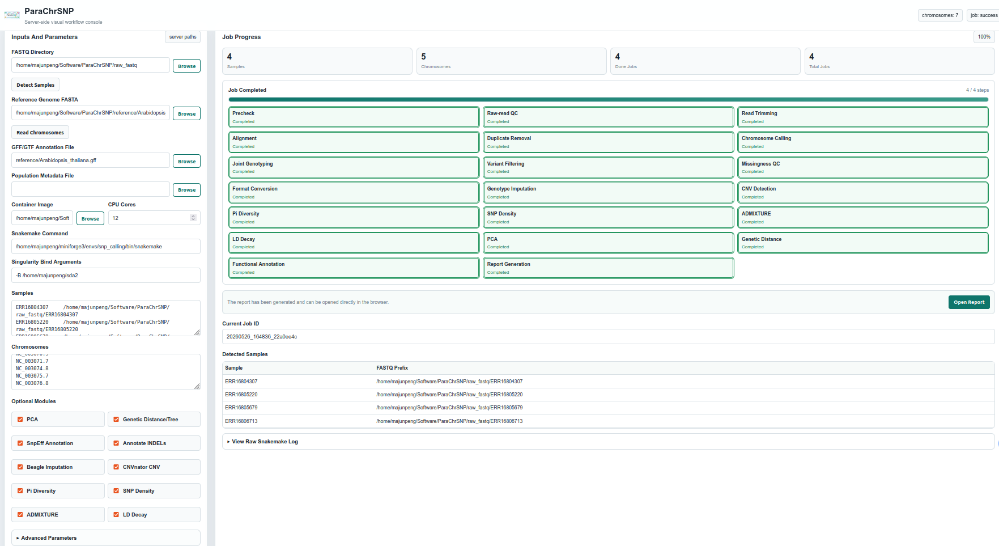

# Web interface

ParaChrSNP includes a lightweight server-side web console for configuring,
starting, and monitoring the Snakemake workflow. It is intended for users who
prefer selecting files and analysis modules in a browser instead of editing
`config.yaml` manually.

The interface does **not** upload FASTQ, FASTA, annotation, or population
files. It browses and uses files that already exist on the server where
ParaChrSNP is installed. The browser and the analysis process therefore see
the same server-side paths.



## What the interface can do

The current interface supports:

- browsing explicitly allowed server directories;
- selecting a FASTQ directory, reference FASTA, GFF3/GTF annotation,
  population metadata, and Singularity/Apptainer image;
- detecting paired FASTQ samples automatically;
- reading chromosome or contig identifiers from FASTA headers;
- selecting CPU resources and Java memory settings;
- enabling PCA, VCF2Dis, SnpEff, Beagle, CNVnator, Pi, SNP density,
  ADMIXTURE, and PopLDdecay;
- generating a separate `config.yaml` for each submitted web job;
- performing a Snakemake dry-run before real execution;
- displaying job state, current stage, completed jobs, total jobs, and raw
  Snakemake logs;
- stopping the active Snakemake process group;
- opening the integrated HTML report after successful completion.

The web interface is a workflow launcher, not a replacement for Snakemake.
All analysis rules, dependencies, output paths, and biological assumptions
remain those of the main ParaChrSNP workflow.

## Requirements

Before starting the web server, confirm that:

- ParaChrSNP and its container image are available;
- the active environment contains Snakemake and PyYAML;
- Python can execute `web/parachrsnp_web.py`;
- FASTQ, reference, annotation, and population files are readable by the user
  running the server;
- selected directories are included in the allowed roots;
- the chosen TCP port is not occupied or blocked by a firewall.

Check the command-line options before starting the service.

```bash
python web/parachrsnp_web.py -h

# python: runs the Python interpreter from the active environment.
# web/parachrsnp_web.py: starts the ParaChrSNP web launcher.
# -h: prints the English help document and exits without starting the server.
```

## Starting the server

### Access from the same computer

Bind to the loopback address when the browser runs on the same machine. This
does not expose the service directly to other computers.

```bash
python web/parachrsnp_web.py \
    --host 127.0.0.1 \
    --port 8088 \
    --allowed-root /home/majunpeng/sda2

# python: uses the active Python environment to run the server.
# web/parachrsnp_web.py: ParaChrSNP web-interface entry point.
# --host 127.0.0.1: listens only on the local loopback interface.
# --port 8088: serves the interface on TCP port 8088.
# --allowed-root /home/majunpeng/sda2: permits the file browser and path validator to access this data directory.
```

Open the following address on the same computer:

```text
http://127.0.0.1:8088
```

### Access from another computer

Bind to all network interfaces when remote access is required on a trusted
network.

```bash
python web/parachrsnp_web.py \
    --host 0.0.0.0 \
    --port 8088 \
    --allowed-root /home/majunpeng/sda2

# --host 0.0.0.0: accepts connections through any network interface on the server.
# --port 8088: selects the listening TCP port.
# --allowed-root /home/majunpeng/sda2: adds the server-side data root that users may browse and submit.
```

Open the server address from the client browser:

```text
http://SERVER_IP:8088
```

Replace `SERVER_IP` with the server's actual IP address or hostname. If the
page cannot be reached, check the firewall, routing, port number, and whether
the Python process is still running.

### Allowing multiple data directories

Repeat `--allowed-root` to make several independent data locations visible.

```bash
python web/parachrsnp_web.py \
    --host 0.0.0.0 \
    --port 8088 \
    --allowed-root /data/fastq \
    --allowed-root /data/reference \
    --allowed-root /data/annotation

# --allowed-root /data/fastq: allows selection of sequencing-read directories.
# --allowed-root /data/reference: allows selection of reference genomes.
# --allowed-root /data/annotation: allows selection of GFF3/GTF annotation files.
# Repeating --allowed-root: adds each path independently instead of exposing their broader parent directory.
```

The project directory is allowed automatically. The program also recognizes
additional colon-separated roots from `PARACHRSNP_ALLOWED_ROOTS`.

## Security considerations

The built-in server does not provide user accounts, authentication, HTTPS, or
per-user authorization. Anyone who can reach the listening port can submit a
workflow using paths inside the allowed roots and view exposed analysis logs
and reports.

For this reason:

- prefer `--host 127.0.0.1` for local use;
- expose `0.0.0.0` only on a trusted network protected by a firewall;
- use the narrowest possible `--allowed-root` directories;
- do not allow a broad home directory when only one project directory is
  required;
- use an authenticated HTTPS reverse proxy if the service must be shared;
- run the service as a non-root user with only the required file permissions.

`--allowed-root` controls the built-in file browser and validates submitted
reference, FASTQ, annotation, and population paths. It does not replace normal
Linux permissions or container bind settings.

## Preparing input files

### FASTQ naming

Automatic detection recognizes gzip-compressed paired files in either of
these forms:

```text
sample1.1.fq.gz
sample1.2.fq.gz
sample2.1.fastq.gz
sample2.2.fastq.gz
```

The detected sample prefix is the complete server path without
`.1.fq.gz`, `.2.fq.gz`, `.1.fastq.gz`, or `.2.fastq.gz`. Both mates must be
present in the same directory. Files named `_R1/_R2`, uncompressed FASTQ
files, or mates stored in different directories are not detected
automatically.

Samples may also be entered manually, one sample per line, using a tab or
comma between the sample name and FASTQ prefix:

```text
sample1    /data/fastq/sample1
sample2    /data/fastq/sample2
```

The sample identifier must be unique. The prefix must resolve to paired files
using ParaChrSNP's expected `.1.fq.gz` and `.2.fq.gz` convention.

### Reference genome

Select the same reference assembly for mapping, variant calling, chromosome
selection, and SnpEff annotation. The **Read Chromosomes** button reads the
first whitespace-delimited identifier from every FASTA header. For example,
the following header is entered as `Chr01`:

```text
>Chr01 chromosome 1
```

Review the detected list and remove organellar contigs, unplaced scaffolds, or
other sequences that should not be called. Identifiers are case-sensitive and
must match the FASTA exactly. An uncompressed FASTA is recommended for the
complete analysis workflow and its indexing tools.

### Annotation file

The GFF3/GTF annotation is required only when SnpEff is enabled. It must
belong to the same assembly as the selected reference FASTA, and its sequence
identifiers must match the reference and configured chromosome names.

### Population metadata

Population metadata are used by group-aware optional analyses. Provide two
columns containing sample and group identifiers:

```text
sample1    Population_A
sample2    Population_A
sample3    Population_B
```

Sample identifiers must match the detected samples and VCF header. Leaving
this field empty makes supported modules analyse all samples together or use
their default ordering.

### Container and bind paths

The container image field selects the `.sif`/`.simg` file used by Snakemake.
Every host path referenced by the generated configuration must also be
visible inside the container. Add explicit bind arguments when data are
outside paths bound automatically by Singularity/Apptainer.

For example, expose FASTQ, reference, and annotation directories at identical
paths inside the container:

```text
-B /data/fastq:/data/fastq -B /data/reference:/data/reference -B /data/annotation:/data/annotation
```

The left side of each `host_path:container_path` pair is the host directory;
the right side is its path inside the container. Using identical paths keeps
the paths written into the generated `config.yaml` valid in both contexts.

## Web-page workflow

### 1. Select primary inputs

Use **Browse** beside each input to navigate only within allowed roots.
Selecting a FASTQ directory automatically triggers sample detection, and
selecting a reference automatically reads chromosome identifiers. The same
actions can be repeated with **Detect Samples** and **Read Chromosomes**.

Always inspect the detected sample and chromosome lists before submission.
Automatic detection confirms naming and paired-file presence; it does not
verify read integrity, sample identity, or reference compatibility.

### 2. Configure execution

Set:

- **Container Image** to the ParaChrSNP Singularity/Apptainer image;
- **CPU Cores** to the maximum total cores Snakemake may schedule;
- **Snakemake Command** to the executable from the desired environment;
- **Singularity Bind Arguments** to any additional host-directory bindings.

The CPU Cores field controls Snakemake's global `--cores` limit. Individual
thread fields control the maximum threads requested by specific rules.
Increasing every rule-level value does not bypass the global limit, and
memory values are not automatically constrained by physical RAM.

If the default Snakemake executable is incorrect, enter an absolute path such
as:

```text
/home/user/miniforge3/envs/parachrsnp/bin/snakemake
```

### 3. Select optional modules

PCA and Genetic Distance/Tree are selected by default in the current page.
Both require at least three configured samples. Other checkboxes enable the
following modules:

| Web option | Generated configuration | Additional requirement |
| --- | --- | --- |
| PCA | `params.vcf2pca.enabled` | At least three samples |
| Genetic Distance/Tree | `params.vcf2dis.enabled` | At least three samples |
| SnpEff Annotation | `params.snpeff.enabled` | Matching FASTA and GFF3/GTF |
| Annotate INDELs | `params.snpeff.annotate_indel` | SnpEff must also be enabled |
| Beagle Imputation | `params.imputation.enabled` | Beagle JAR available in the container or configured paths |
| CNVnator CNV | `params.cnv.enabled` | Deduplicated BAMs generated by the workflow |
| Pi Diversity | `params.pi.enabled` | Optional population metadata |
| SNP Density | `params.snp_density.enabled` | Reference index and filtered SNP VCF |
| ADMIXTURE | `params.admixture.enabled` | PLINK conversion and preferably LD-pruned informative markers |
| LD Decay | `params.ld_decay.enabled` | PopLDdecay and optional population metadata |

See the [optional analysis module guide](../usage/optional_modules.md) for
biological interpretation, parameters, and outputs.

### 4. Review advanced parameters

The Advanced Parameters panel controls:

- threads for quality control, fastp, alignment, sorting, HaplotypeCaller,
  PCA, TASSEL, PLINK, Beagle, ADMIXTURE, PopLDdecay, and GenomicsDBImport;
- GenomicsDB batch size;
- CNVnator bin size and CNV summary thresholds;
- Pi window size and step;
- SNP-density window size;
- PopLDdecay maximum distance;
- ADMIXTURE K range, CV folds, LD-pruning threshold, and sample labels;
- Java minimum and maximum heap sizes for GATK steps, SnpEff, and Beagle.

Memory values accept strings such as `512m`, `4g`, and `128g`. Do not assign
the full physical memory to several rules that may run concurrently. The sum
of concurrent rule memory use must remain below available RAM.

### 5. Perform a dry-run

Select **Dry-run** before real execution. The server creates a job-specific
configuration and runs Snakemake with `-n`, allowing missing inputs,
configuration errors, and DAG problems to be found without executing
analysis rules.

A dry-run still creates a directory under `web_runs/` containing the generated
configuration and Snakemake log.

### 6. Start and monitor the workflow

After a successful dry-run, select **Run Workflow**. The interface polls the
server approximately every 2.5 seconds and displays:

- job state: queued, running, success, failed, or stopped;
- sample and chromosome counts;
- completed and total Snakemake jobs;
- overall progress percentage;
- pending, running, and completed workflow stages;
- the most recent raw Snakemake log content.

Progress is parsed from Snakemake text output. The raw log remains the
authoritative source when the displayed stage or percentage appears unclear.

### 7. Stop a job

**Stop Job** sends a termination signal to the active Snakemake process group.
It does not delete completed or partial output files, and it does not
automatically unlock the Snakemake working directory. Before restarting,
confirm that no workflow process remains and inspect the log and incomplete
outputs.

### 8. Open the report

After a successful workflow, **Open Report** displays
`reports/ParaChrSNP_report.html`. The report and output links are served from
the ParaChrSNP project directory. If several analyses use the same project
directory, the button refers to the report currently present there.

## Generated job files

Each submitted dry-run or real run receives a unique directory:

```text
web_runs/YYYYMMDD_HHMMSS_<job-id>/
├── config.yaml
└── snakemake.log
```

- `config.yaml` records the exact values generated from the web form.
- `snakemake.log` records the executed command, Snakemake DAG, progress,
  warnings, and errors.

Analysis outputs are **not** isolated inside the job directory. Snakemake runs
with the ParaChrSNP project root as its working directory, so BAMs, GVCFs,
VCFs, figures, and reports use the normal project output directories. Avoid
running different datasets concurrently from one ParaChrSNP checkout because
their output filenames can conflict.

Job state is held in server memory. Restarting the web server preserves files
under `web_runs/` but removes the previous jobs from the live status page.

## Troubleshooting

### `Path is outside allowed roots`

Restart the server with the relevant directory as a narrowly scoped
`--allowed-root`. Both manually typed paths and paths chosen in the browser
are validated.

### No samples are detected

Confirm that both mates are gzip-compressed, reside in the same directory,
and use `.1.fq.gz/.2.fq.gz` or `.1.fastq.gz/.2.fastq.gz`. Otherwise rename the
files or enter compatible sample prefixes manually.

### No chromosomes are detected

Confirm that the selected file is a readable FASTA with headers beginning
with `>`. Check whether it is compressed correctly and whether the selected
path refers to the intended assembly.

### `command not found` for Snakemake

Start the server from the Snakemake environment or set the page's Snakemake
Command field to the absolute executable path. The error log records the
command that the server attempted to run.

### Container cannot see the data

Add the data directories to **Singularity Bind Arguments**. A directory being
visible in the web file browser does not guarantee that it is visible inside
the container.

### Job fails immediately

Open **View Raw Snakemake Log** and inspect the first reported exception.
Common causes include missing inputs, mismatched chromosome identifiers,
incorrect container paths, unavailable optional software, insufficient Java
memory, or a locked working directory.

### Port is already in use

Choose another port and use the same value in the browser address.

```bash
python web/parachrsnp_web.py \
    --host 127.0.0.1 \
    --port 8090 \
    --allowed-root /data/project

# --port 8090: uses an alternative port when 8088 is occupied.
# --allowed-root /data/project: limits file selection to the intended project data.
```

### A stopped or failed run cannot restart

First verify that no Snakemake process is still running. If Snakemake reports
a stale lock, unlock the project working directory.

```bash
snakemake \
    --snakefile Snakefile \
    --configfile web_runs/JOB_ID/config.yaml \
    --unlock

# snakemake: invokes the workflow manager from the active environment.
# --snakefile Snakefile: selects the ParaChrSNP workflow entry point.
# --configfile web_runs/JOB_ID/config.yaml: reuses the configuration generated for the affected web job.
# --unlock: removes a stale Snakemake lock without running analysis rules.
```

Replace `JOB_ID` with the actual directory name recorded by the web interface.
Only unlock after confirming that no other ParaChrSNP/Snakemake process is
using the same project directory.

