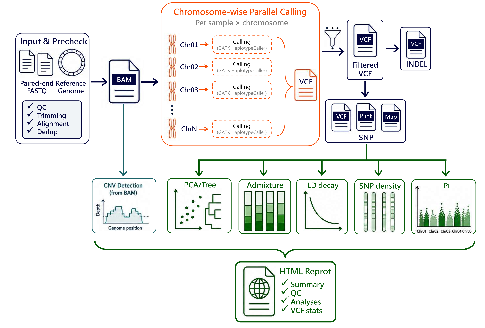

# ParaChrSNP 中文帮助文档

ParaChrSNP 是基于 Snakemake 和容器的染色体级变异检测流程。它支持双端 FASTQ 或已经去重复、按坐标排序的 BAM 输入，串联质控、比对、去重复、逐样本逐染色体 GVCF 生成、群体联合分型、SNP/INDEL 输出，以及可选的群体遗传分析。默认示例使用 GLnexus 联合分型；也保留 GenomicsDB 和 CombineGVCFs。



## 性能参考

下表是 512 GB 内存、64 CPU 核心服务器上的实测运行时间，单位为分钟。实际耗时还受样本数、测序深度、存储性能和可选模块影响。

| 物种 | 基因组大小 | 10× | 30× | 50× | 100× |
| --- | ---: | ---: | ---: | ---: | ---: |
| 拟南芥 | 0.12 Gb | 2.72 | 8.56 | 13.98 | 25.75 |
| 西瓜 | 0.37 Gb | 8.16 | 22.75 | 39.71 | 82.64 |
| 大豆 | 0.98 Gb | 24.82 | 74.26 | 128.81 | 251.53 |
| 茶树 | 2.96 Gb | 71.64 | 201.31 | 394.05 | 746.34 |

```{toctree}
:maxdepth: 2
:caption: 目录

installation/index
quick_start/index
usage/index
web_interface/index
changelog/index
faq/index
```
