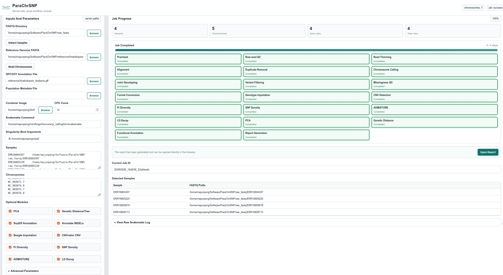

# Web 界面

ParaChrSNP 提供轻量级服务器端网页，用于选择数据、生成任务配置、启动和监控 Snakemake。它不会把 FASTQ、参考基因组或注释文件从浏览器上传到服务器，而是读取**服务器上已经存在**的文件。网页是流程启动器，不替代 Snakemake，也不改变主流程的生物学假设。

目前网页的自动样本检测只支持双端 FASTQ；`Types: bam` 请通过配置文件和命令行运行。



## 启动前检查

确认项目代码、容器、宿主机 Snakemake 与 PyYAML 已准备好；服务器账户能够读取 FASTQ、FASTA、注释及群体文件；数据目录已列入允许访问的根目录；端口未被占用或被防火墙阻挡。

先查看程序帮助和参数。

```bash
python web/parachrsnp_web.py -h

# python: 使用当前环境的 Python 解释器。
# web/parachrsnp_web.py: Web 服务入口。
# -h: 仅输出英文帮助，不启动服务。
```

### 仅供本机访问

浏览器与服务在同一台机器时，绑定回环地址。

```bash
python web/parachrsnp_web.py --host 127.0.0.1 --port 8088 --allowed-root /data/project

# --host 127.0.0.1: 仅允许本机访问。
# --port 8088: Web 服务监听的 TCP 端口。
# --allowed-root /data/project: 允许浏览和提交此服务器端数据目录。
```

在本机浏览器访问 `http://127.0.0.1:8088`。

### 可信内网中的远程访问

需要其他计算机访问时，可绑定所有网络接口，但必须设置防火墙或经过认证的反向代理。

```bash
python web/parachrsnp_web.py --host 0.0.0.0 --port 8088 --allowed-root /data/project

# --host 0.0.0.0: 接受来自服务器各网卡的连接。
# --port 8088: 监听端口，浏览器端要使用同一端口。
# --allowed-root /data/project: 限制可选择的数据范围。
```

客户端访问 `http://SERVER_IP:8088`，将 `SERVER_IP` 换为服务器地址。可重复填写 `--allowed-root` 来允许多个独立目录，而不要直接暴露整个家目录。项目目录默认可访问；还可通过冒号分隔的 `PARACHRSNP_ALLOWED_ROOTS` 增加目录。

## 安全边界

内置服务**没有账户认证、HTTPS 或逐用户授权**。任何能连通端口的人都可能使用允许目录中的路径启动任务，并查看日志和报告。因此推荐优先使用 `127.0.0.1`；远程服务仅放在受信网络，按最小权限运行，不以 root 身份启动。`--allowed-root` 只限制网页选择和提交路径，不能替代 Linux 文件权限与容器 bind 挂载。

## 输入准备

### 自动识别双端 FASTQ

同一目录下的配对文件必须符合以下两种形式之一：

```text
sample1.1.fq.gz    sample1.2.fq.gz
sample2.1.fastq.gz sample2.2.fastq.gz
```

自动检测会用去掉上述后缀后的完整服务器端路径作为前缀。`_R1/_R2` 命名、未压缩 FASTQ 或分散在不同目录的两端文件不会自动识别。也可手动逐行输入“样本名 + 制表符或逗号 + FASTQ 前缀”，但前缀仍须解析成流程要求的 `.1.fq.gz/.2.fq.gz` 文件。样本名不可重复。

### 参考、注释和群体文件

**Read Chromosomes** 从每条 FASTA 标题提取第一个空白前的序列 ID；例如 `>Chr01 chromosome 1` 得到 `Chr01`。核对并按需要去掉细胞器、未定位片段等；大小写必须与 FASTA 完全一致。建议使用未压缩 FASTA 供索引工具处理。

仅在启用 SnpEff 时需要 GFF3/GTF；它必须与比对参考属于同一组装版本，序列名一致。群体信息是两列文本：样本 ID 与群体名；样本 ID 要与检测样本及 VCF 头一致。

### 容器内路径

网页能浏览某路径，不代表容器内也能访问。若 FASTQ、参考或注释位于默认绑定范围外，在 **Singularity Bind Arguments** 中显式填写，例如：

```text
-B /data/fastq:/data/fastq -B /data/reference:/data/reference -B /data/annotation:/data/annotation
```

每组冒号左边是主机路径，右边是容器路径；保持两侧相同可避免生成的 `config.yaml` 在容器内失效。

## 页面操作顺序

1. **选择输入。** 使用 Browse 在允许目录内选择 FASTQ 目录与参考 FASTA；选择后会自动检测样本和染色体，也可点 **Detect Samples**、**Read Chromosomes** 重试。自动检测只检查命名和配对文件存在，不能证明 reads 完整或样本身份正确。
2. **设定资源。** 选择容器文件、CPU Cores、Snakemake Command 与额外 bind 参数。CPU Cores 是全局 `--cores` 上限，规则级线程数不能突破这个上限；Java 堆内存不会自动受物理 RAM 限制。若环境中的 Snakemake 不在 PATH，可填写绝对路径。
3. **选择可选模块。** 当前页面默认选择 PCA 和 Genetic Distance/Tree，两者至少需要 3 个样本。其他复选框对应 SnpEff、Beagle、CNVnator、Pi、SNP density、ADMIXTURE 和 LD decay；详细用途见[可选模块指南](../usage/optional_modules.md)。
4. **检查高级参数。** 可调整质控、比对、HaplotypeCaller、GATK、绘图等线程数，GenomicsDB 批大小，CNV bin，Pi/SNP density 窗口，LD 距离，ADMIXTURE K 范围及 Java 堆内存。并行规则内存总和应小于机器可用内存。
5. **先 dry-run。** 点击 **Dry-run** 后，服务器创建专属配置并运行 Snakemake `-n`；这会建立 `web_runs/` 任务目录和日志，但不执行分析规则。
6. **启动并监控。** 点击 **Run Workflow**；页面约每 2.5 秒更新任务状态、样本和染色体数、完成/总任务数、阶段和原始日志。百分比来自 Snakemake 文本解析，有疑问时以原始日志为准。
7. **停止或查看报告。** **Stop Job** 会向当前 Snakemake 进程组发终止信号，不删除已有结果或自动解锁。成功后 **Open Report** 打开 `reports/ParaChrSNP_report.html`。

## 任务文件与输出位置

每次提交会建立 `web_runs/YYYYMMDD_HHMMSS_<job-id>/`，其中 `config.yaml` 记录网页生成的配置，`snakemake.log` 保存命令、进度和错误。**分析结果不在这个任务目录内隔离**：Snakemake 始终在 ParaChrSNP 项目根目录写入 BAM、GVCF、VCF 和报告。不要从同一个 checkout 并发提交不同数据集，否则输出文件名可能互相覆盖。服务重启后，旧任务文件仍在磁盘，但内存中的实时任务列表会清空。

## 常见问题

- **Path is outside allowed roots：** 用范围尽量窄的 `--allowed-root` 重新启动服务；手动输入的路径也受检查。
- **没有检测到样本：** 检查两端文件是否同目录、gzip 压缩且命名为 `.1/.2.fq.gz` 或 `.1/.2.fastq.gz`。
- **没有染色体：** 检查所选文件是否可读、是否是真正的 FASTA，以及标题是否以 `>` 开头。
- **Snakemake command not found：** 从已安装 Snakemake 的环境启动网页，或在页面填入其可执行文件绝对路径。
- **容器看不到数据：** 在 Singularity Bind Arguments 中挂载对应目录；网页浏览权限与容器挂载是两回事。
- **任务立即失败：** 查看 **View Raw Snakemake Log** 的第一处异常，再检查输入、染色体名、镜像、可选软件、Java 内存和工作目录锁。
- **端口被占用：** 换一个未占用端口，浏览器地址也同步修改。

任务停止后，如确认没有残留 Snakemake 进程且出现陈旧锁，才使用 `--unlock`；切勿在其他流程仍运行时解锁。
